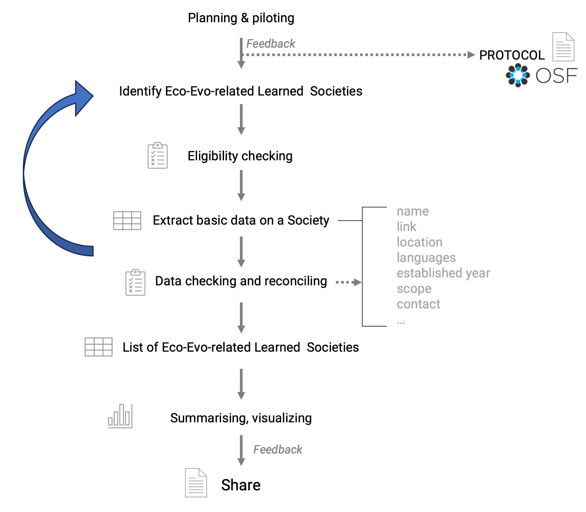
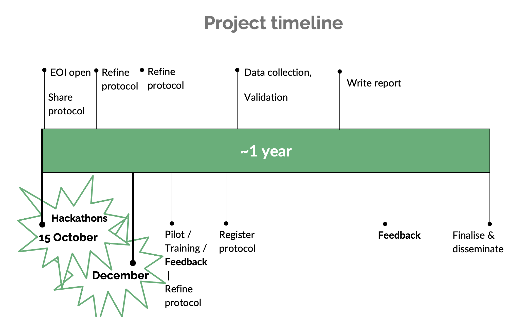

# EcoEvo Societies list

Creating a global list of EcoEvo-related learned societies

**Our mission statement:** *Making science more collaborative and transparent.* 🌟  

  

(If you are reading this on GitHub, you can also see this repository as a webpage [here](https://mlagisz.github.io/EcoEvo_societies_list/)🌍).   

## 🔖 Background   
LLearned societies — professional organizations that unite researchers and academics — play a crucial role in advancing science, fostering collaboration, and supporting professional development. 
Globally, thousands of such societies connect scholars in Ecology and Evolutionary biology (Eco-Evo). 
Yet, no comprehensive or centralised resource currently exists to identity these societies.

## 🏹 Aims and approach  
TThis project aims to fill a key gap by systematically collecting and curating basic information on learned societies in Ecology and Evolutionary Biology (Eco-Evo) worldwide.

## 🪓 Impact  
This project offers a unique opportunity to showcase the diversity of learned societies from non-English-speaking countries.
Th elist will foster meta-research and contribute to building lasting connections between these societies and SORTEE in the future.

## 💎 Team  
We have an diverse and open team of early- and mid-career researchers contributing to this project. 
We warmly encourage contributors from traditionally underrepresented and marginalised groups in research.
Please get in touch if you are interested in contributing to this and/or future projects.

## 💛 Contributing  
Overall, when you work with us:   

We invite researchers at any career stage with a background in ecology and/or evolutionary biology and any related disciplines to contribute to the project. All contributions will be acknowledged. Significant contributions (as outlined below), will warrant co-authorship,
This project has no dedicated funding (i.e., zero budget) and, unfortunately, we cannot compensate project contributors for their time. Instead, we offer an opportunity to become a co-author.
Given the contribution requirements for authorship (described below), there are places for additional authors (in addition to ML and AST, who lead this project). 
The final number of authors will depend on the individual contributions warranting authorship. The expected time you may spend on this project is expected to be around 2-20 hours in total, across one year (likely duration of this project), but will depend on the number of societies found for data extraction/checking, the final number of contributors, and their speed/quality of work. 
We welcome and actively encourage the participation of researchers from historically underrepresented and marginalized groups, valuing their unique perspectives and experiences as essential contributions to this work.

Key points: 
- You do not need any special research skills - just attention to detail, Internet access and some time available.   
- You will need to fill in the Expression Of Interest (EOI) form to provide us with your details. 
- We already had an initial virtual hackathon (an intial information and feedback meeting) in October 2025, and the next one will be in December 2025. 
- We can schedule additional virtual meetings if needed. 
- Let us know  like you would like to chat with the leaders or other project participants. Send your suggestions!  
- Except the hackathons (which are not compulsory to participate in), we do all the work asynchronously online until we complete all tasks of the project.    
- For more details on how to contribute and how we deal with recognizing everybody's contributions see our full [CONTRIBUTION GUIDE](/CONTRIBUTING.md).  
- We expect all project contributors to familiarize themselves and follow our [CODE OF CONDUCT](/CODE_OF_CONDUCT.md).   
- If you would like to comment on this project or provide suggestions to improve it, feel free to open an issue on GitHub, reach directly to us via email or a dedicated SORTEE (Society for Open, Reliable, and Transparent Ecology and Evolutionary Biology, www.sortee.org) Slack channel (join SORTEE and get invited to their Slack workspace, then join channel #conf2025-h05-lets-expand-the-dataset-of-learned-societies).
- We will periodically send you updates on the project progress. 
- Our main way of communicating is via emails and comments on shared Google Docs (used for data collection). 
- We will email specific contributing instructions to the project participants for the project tasks they are assigned to.
- We will also provide clarifications and answer questions via email and dedicated Slack channel, as needed (please get in touch when you need help or explanations). 
- Importantly, please let us know when you are stuck or you do not have time to finish a given task, so we can find replacement and keep moving forward. 
- You can withdraw from the project at any time (but please let us know if you do!).   

## 🗺 Workflow
  

## 📅 Timeline
  

## 🚉 Current status    
Piloting and protocol feedback.   

## 🚀 Protocol   
Final protocol will be publicly archived on OSF.org [LINK to be added].   

## 🚚 Supporting information 
Supporting information for this project will be publicly available at [LINK to be added].    

## 💻 Data and code files      
A copy of our final data and code files will be publicly availabe at [LINK to be added].     

## ⏰ Code of Conduct   
We expect all project contributors to familiarize themselves and follow our [CODE OF CONDUCT](/CODE_OF_CONDUCT.md).      

## 🎏 Project Leads(s)
* [Malgorzata (Losia)  Lagisz](https://github.com/mlagisz).  
* [Alfredo Sánchez-Tójar](https://github.com/ASanchez-Tojar).  

## 🔧 Maintainer(s)
* [Malgorzata (Losia) Lagisz](https://github.com/mlagisz).   

## 🖍️ License 
This work is licensed under a [Creative Commons Attribution 4.0 International License (cc-by)](/LICENSE.md).   
